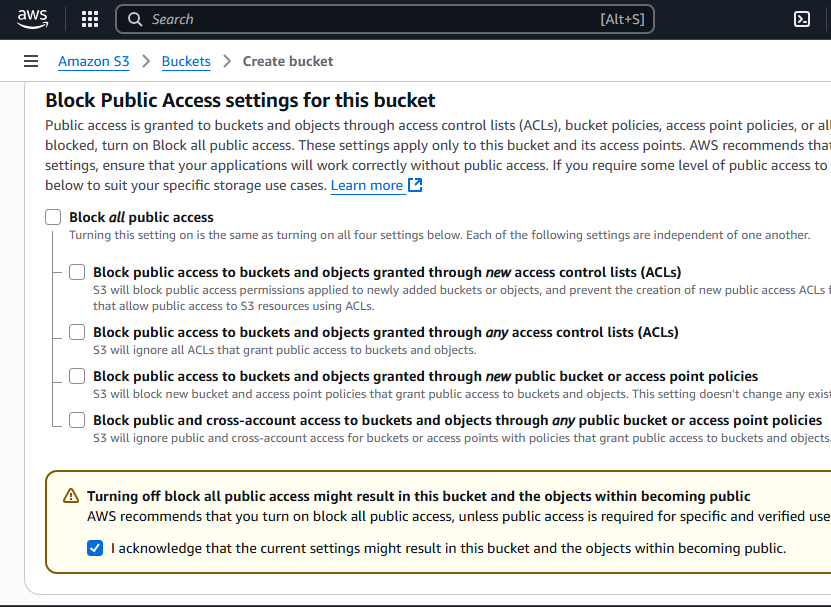
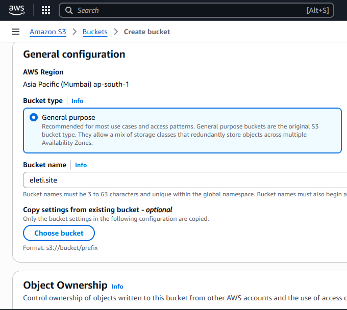
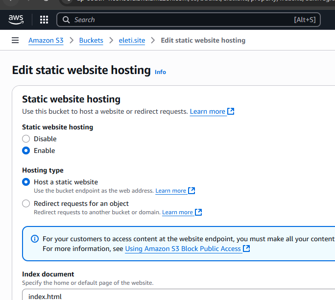
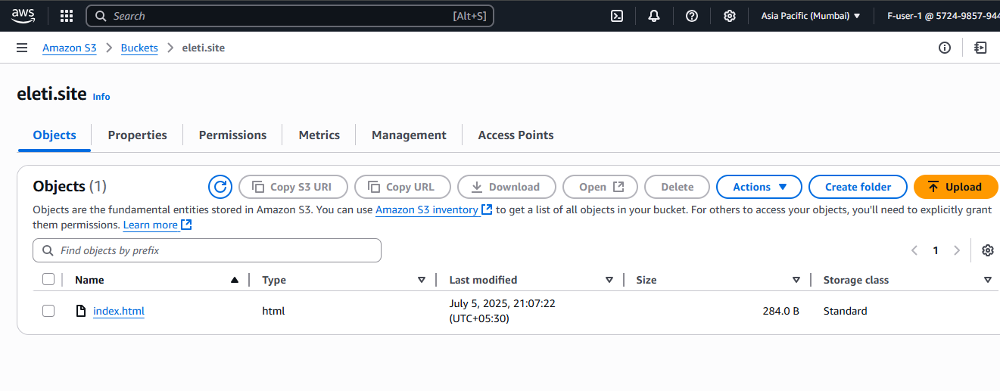
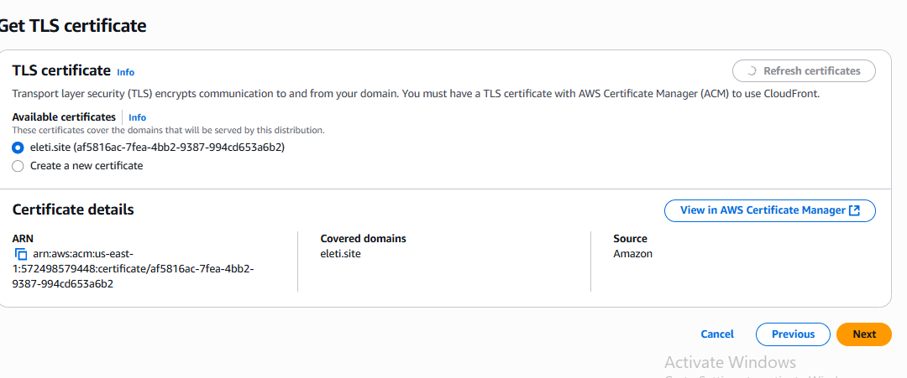
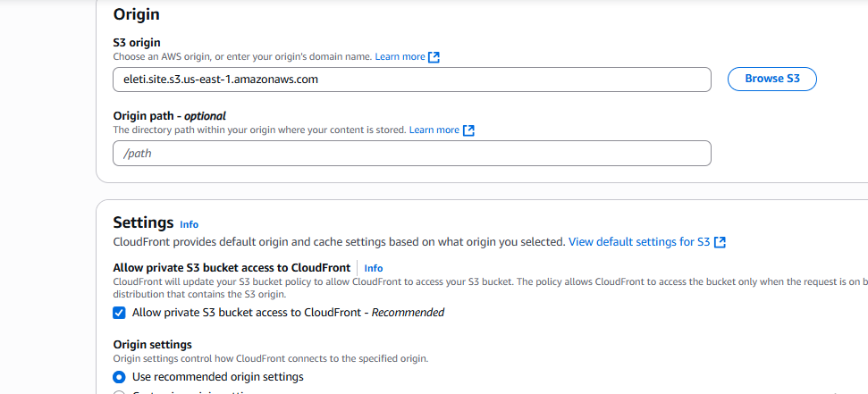
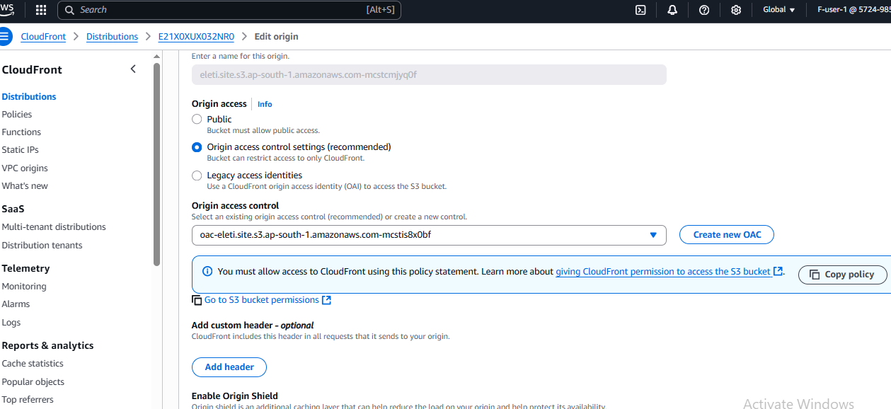
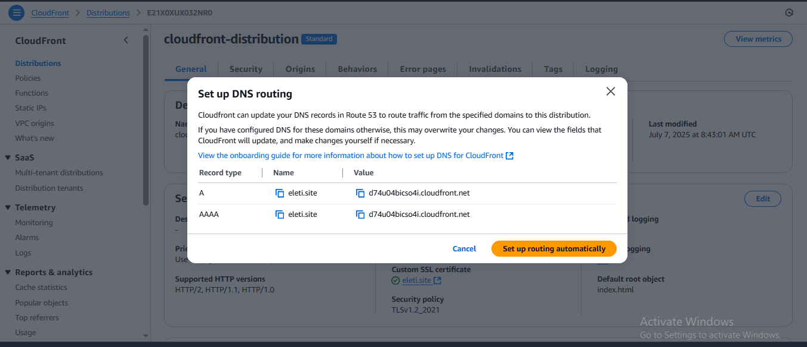
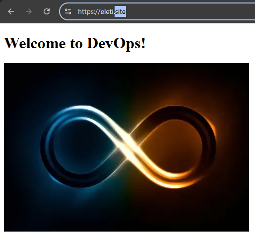

#  Static Website Hosting on AWS S3 with Versioning (Private Access Only)

This project explains how to host a static website on AWS using **S3**, with **versioning enabled** and **public access blocked**. Later, we will connect it to **CloudFront + HTTPS + Route 53** for secure delivery.

This is the first phase of building a fully secure static website using AWS cloud services.

---

##  What This Project Does

- Creates an **S3 bucket** to host static website files like `index.html` and `error.html`
- Enables **versioning** to keep history of changes
- **Blocks public access** to make sure the content isn’t directly exposed
- **Does not enable** static website hosting (CloudFront will access the bucket via OAC)
- Ensures access is only allowed through **CloudFront**, not directly via S3
  
---

##  AWS Services Used

- **Amazon S3** – to securely store static website files
- **S3 Versioning** – to keep historical versions of files
- **Amazon CloudFront** – to distribute content globally with low latency
- **AWS Certificate Manager (ACM)** – to enable secure HTTPS connections
- **Amazon Route 53** – to manage custom domain and DNS routing

---

##  Screenshots - Phase 1: S3 Setup

| Step                    | Screenshot |
|-------------------------|------------|
| ✅ Block Public Access  |  |
| ✅ Create Bucket        |  |
| ✅ Enable Static website|  |
| ✅ Upload index file    |  |

## Phase 2: SSL Certificate & CloudFront CDN

To enable secure HTTPS access, we first request a public certificate from **AWS Certificate Manager (ACM)** for the custom domain.

### 1. Request SSL Certificate (ACM)

- Open **AWS Certificate Manager** in **us-east-1**
- Request a public certificate for: `eleti.site`
- Choose **DNS validation**
- Add validation CNAME records to **Route 53** (auto or manually)

✅ Screenshot:  

---

### 2. Create CloudFront Distribution

- Origin Domain : use **S3 endpoint** (e.g., `eleti.site.s3-us-east-1.amazonaws.com`)
- Attach **SSL certificate** from ACM
- Set viewer protocol policy: **Redirect HTTP to HTTPS**
- Allowed methods: **GET, HEAD**
- Cache policy: **CachingOptimized**

✅ Screenshot:  

---

### 3. Attach OAC and Update Bucket Policy

- Create an **Origin Access Control (OAC)**
- Choose type: `S3`
- Sign requests: Yes
- Update bucket policy which copied from cloudfront

✅ Screenshot:  

---

### 4. Route 53 DNS Configuration

- Automattically popup comes after creating distribution 
- Click on setup route automattically 
- Wait for DNS propagation

✅ Screenshot:  

---

## Final Output

Live website preview (via CloudFront + HTTPS + Route 53)
✅ Screenshot:

